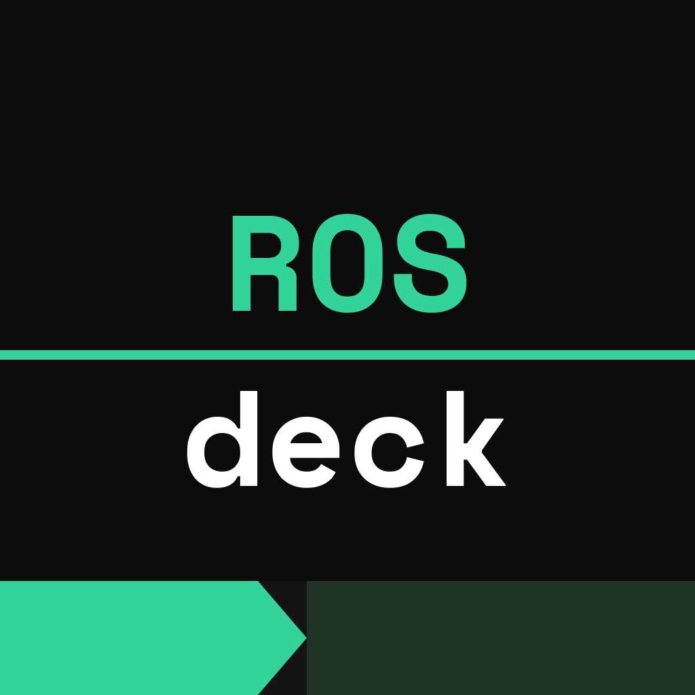
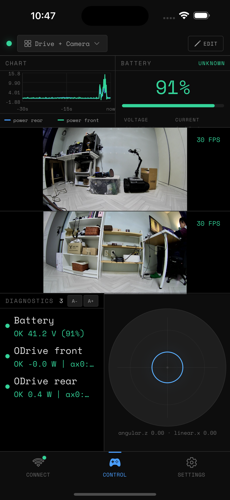

<p align="center">
  
</p>

<h1 align="center">ROSDeck</h1>

<p align="center">
  <strong>The mobile dashboard for ROS2 robots.</strong><br/>
  Teleop joystick, live camera, 2D/3D map goals, diagnostics, and gamepad support — all from your phone.<br/>
  Connect over WiFi via rosbridge or Foxglove. No DDS, no VPN, no laptop required.<br/><br/>
  <a href="https://rosdeck.github.io">Sign up for the beta</a> or build it yourself.
</p>

<p align="center">
  
  
  
</p>

---

<p align="center">
  
  
</p>

## Why ROSDeck?

[ROS-Mobile](https://github.com/ROS-Mobile/ROS-Mobile-Android) was the go-to for ROS1 (500+ stars, 13K+ downloads, 4.5+ rating) but is stuck on ROS1, which hit EOL in May 2025. ROS2 adoption is growing fast with no polished mobile equivalent. ROSDeck fills that gap — a native, cross-platform app purpose-built for ROS2.

## Features

- **Teleop joystick** — virtual thumbstick publishing authenticated `/omni/control/teleop` (`TeleopCommand`, including the App lease `client_id`); topic detection retains `/vel_cmd` (`Twist`) for older VBot deployments
- **Fail-closed safety panel** — shows live Safety Supervisor and velocity-arbiter health, rejects stale status, and requires two independent confirmations before arming the supervisor and resetting the Bridge E-stop
- **Bluetooth gamepad support** — connect an Xbox, PS5, or generic BT controller; auto-maps sticks to joystick widgets with configurable deadzone and layout
- **Live camera** — subscribe to `CompressedImage` topics or connect to an MJPEG stream
- **2D/3D map** — render `OccupancyGrid`, `LaserScan` or Matrix registered point clouds and show the robot pose from the canonical Omni TF tree
- **Managed point navigation** — long-press either a grid map or verified `omni_map` point cloud, fine-tune X/Y on the phone, then submit only through Mission Manager's typed navigation API
- **Authoritative map picker** — refresh `/omni/maps/list` from Mission Manager before navigation or route recording and carry the selected ID/version/SHA-256 tuple unchanged; phone cache is never treated as an asset source
- **Inspection asset gate** — keep legacy routes visible for diagnosis, but disable dispatch until a route has been re-recorded with canonical `omni_map` coordinates and an exact map ID/version/SHA-256 binding
- **Robot-scoped mission state** — subscribe to Mission/Robot state once at the application root, deduplicate durable events, and refresh the authoritative route catalog whenever the mission tab regains focus so cached tabs never reuse another robot's assets
- **Consistent inspection intent** — both mission entry points use the same 30-minute end-to-end command lifetime and the same route, robot-state, active-mission and E-stop gates
- **Fail-closed mission heartbeat** — expire MissionStatus and RobotState independently after 3.5 seconds, hide stale telemetry and re-check route identity and safety after confirmation immediately before dispatch
- **Fail-closed authority heartbeat** — clear the local control owner and disable teleop/posture commands when the Bridge's 500 ms authority stream is silent for 2 seconds; a connected WebSocket alone never proves ownership
- **Rosbridge & Foxglove** — connect via `rosbridge_server` (port 9090) or `foxglove_bridge` (port 8765), no DDS configuration needed
- **Customizable layouts** — tmux-style split panes, swap and resize widgets, save/load per robot
- **Auto-layout** — detects available topics on connect and suggests a matching layout
- **Demo mode** — try the full app without a robot
- **English / 中文 UI** — switch languages instantly from Settings
- **VBot 3D mapping** — start the robot's fixed SLAM mapping script from the control screen through a restricted ROS 2 bridge
- **VBot / Zsibot adapters** — one phone protocol with profile-specific native robot control and deployment

### Widgets

| Category | Widget       | Message Type                              |
| -------- | ------------ | ----------------------------------------- |
| Control  | Joystick     | `geometry_msgs/Twist`, `TwistStamped`     |
| Sensor   | Camera       | `sensor_msgs/CompressedImage`, `Image`    |
| Sensor   | Battery      | `sensor_msgs/BatteryState`                |
| Sensor   | IMU          | `sensor_msgs/Imu`, `MagneticField`        |
| Sensor   | Line Chart   | Any numeric topic field                   |
| Nav      | Map          | `nav_msgs/OccupancyGrid` + TF + LaserScan |
| Nav      | 3D Point Cloud | `sensor_msgs/PointCloud2` + TF           |
| Debug    | Topic Viewer | Any topic (raw JSON)                      |
| Debug    | Rosout       | `rcl_interfaces/Log`                      |
| Debug    | Diagnostics  | `diagnostic_msgs/DiagnosticArray`         |
| Debug    | TF Tree      | `/tf`, `/tf_static`                       |

The map widgets never publish legacy `/goal_pose` commands. They produce an editable
`omni_map` target draft; the control cockpit verifies the active map identity and sends it
through `/omni/mission/navigation/submit`.

Starting point navigation or route recording opens the robot-backed map catalog, including
after a cold App/Manager start where runtime status has no map identity. The picker calls only
the public `/omni/maps/list` service; the gateway denies direct access to
`/omni/slam/maps/list`.

## Getting Started

### Prerequisites

- Node.js and npm
- [Expo CLI](https://docs.expo.dev/get-started/installation/)
- A ROS2 robot running `rosbridge_server` or `foxglove_bridge`

### Robot Setup

```bash
# Install rosbridge
sudo apt install ros-${ROS_DISTRO}-rosbridge-suite

# Launch it
ros2 launch rosbridge_server rosbridge_websocket_launch.xml
```

### App Setup

```bash
git clone https://github.com/baunuri/rosdeck.git
cd rosdeck
cp app.json.example app.json
cp eas.json.example eas.json
npm install
npm start
```

### Robot-side services

Foxglove cannot execute robot-side files directly. Mission execution,
autonomous docking and vendor SDK access are deployed on the robot from their
independent repositories:

- [`omni_mission_manager`](https://github.com/YanYaoyuan/omni_mission_manager)
- [`omni_docking`](https://github.com/YanYaoyuan/omni_docking)
- [`omni_robot_bridge`](https://github.com/YanYaoyuan/omni_robot_bridge)

This repository owns the App and its authenticated `omni_ws_gateway`; it no
longer vendors copies of the robot runtime. See [`robot/README.md`](robot/README.md)
for ownership, interface and startup boundaries.

Edit `app.json` with your own `slug`, `bundleIdentifier`, `package`, and EAS `projectId` before building.

### Build

```bash
npx expo prebuild --platform android  # generate android/ once for Android Studio
npm run build:android-debug        # Debug APK
npm run build:android-preview      # Release APK
npm run build:android-production   # AAB for Play Store
```

You can also open the generated `android/` directory in Android Studio and use
**Build > Build APK(s)**. Select JDK 17 under **Settings > Build Tools > Gradle
> Gradle JDK** (download it there if Android Studio only offers JDK 25). Rerun
Expo prebuild after changing native Expo configuration or native modules.

## Tested With

- TurtleBot4 (Gazebo simulation)
- [SMUB](https://blog.podri.org/2022/08/21/SMUB/) (Super Mega Ultra Bot, a DIY rover robot)
- A generic smartphone Bluetooth gamepad controller

Works with any ROS2 robot that runs a WebSocket bridge (Humble, Jazzy, Rolling).

## Architecture

```
app/(tabs)/           # Three-tab UI: Connect, Control, Settings
widgets/              # Widget definitions and components
stores/               # Zustand state management
lib/                  # Transport layers (rosbridge, foxglove, demo)
hooks/                # React hooks (cmd_vel publisher, gamepad input, orientation)
modules/expo-gamepad/ # Native Expo module for Bluetooth gamepad input (Kotlin + Swift)
components/           # Shared React Native components
types/                # TypeScript interfaces
```

### Tech Stack

- **React Native** (Expo SDK 55) — cross-platform native app
- **TypeScript** — type-safe codebase
- **Zustand** — lightweight state management
- **roslibjs** — rosbridge WebSocket protocol
- **@foxglove packages** — Foxglove WebSocket protocol with CDR serialization
- **react-native-skia** — high-performance canvas rendering for map and laser scan
- **react-native-reanimated** — smooth joystick and UI animations

## License

GPLv3 — see [LICENSE](LICENSE).

You can build and use this app freely. If you distribute a modified version, you must open-source your changes under the same license.

## dog1：Foxglove 遥控与建图

连接 `ws://192.168.127.2:8765`，机器人端运行
`ros2 launch rosdeck_robot_bridge dog1_mapping.launch.py`。
发现 `/vel_cmd`、LOCO 状态且确认该 VBot 不支持控制租约后，App 会把此连接下
所有内置默认摇杆（包括 3D 建图布局）配置到 `geometry_msgs/msg/Twist` 的 `/vel_cmd`。
用户自定义话题及速度设置保留。

摇杆先请求 LOCO，收到成功响应后发布非零速度；松手发送对应轴零速度。
站立/卧下或控制会话变化后，App 重新请求 LOCO，避免使用失效的行走模式缓存。
建图仍使用现有 Mission/SLAM 接口，支持开始、点云预览、保存和丢弃。

2026-09-15 的验证覆盖真实雷达建图和保存，以及隔离执行器的移动消息通路。
实际行走、断网停车和移动建图精度尚需现场验证。
Android APK 通过 GitHub Release 分发，`build_out/` 为本地产物，不提交到 Git。
